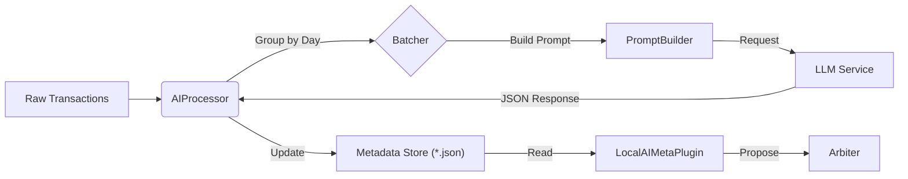

# Day 3 Implementation Plan: AI Infrastructure & Batch Processing

## 1. 核心目标 (Objectives)
Day 3 的任务是构建 **高吞吐、低耦合** 的 AI 分类基础设施。
我们将不再试图把 AI 塞进实时的 `Arbiter` 循环中，而是将其设计为一个独立的 **异步批量处理器 (Async Batch Processor)**。

*   **批量交互**: 以“天”为单位聚合交易，一次 API 调用处理当天所有流水，大幅降低 Token 开销并利用时间上下文。
*   **解耦架构**: 
    *   `LLMClient`: 纯粹的 HTTP 轮子，负责网络与重试。
    *   `PromptBuilder`: 负责拼接上下文、规则和样本。
    *   `AIProcessor`: 负责业务调度（按天切分、并发控制）。
*   **无状态会话**: 采用 Stateless 模式，通过动态 Prompt 注入上下文，而非维护长连接会话。

## 2. 架构设计 (Architecture Design)

### 2.1 数据流向 (Data Flow)


### 2.2 模块定义

#### A. 基础通信层 (`src/core/llm/infrastructure`)
纯粹的“轮子”，不包含任何 PixelBill 业务逻辑。

*   **Interfaces**:
    ```typescript
    interface ILLMClient {
      chat(messages: ChatMessage[], config?: LLMConfig): Promise<string>;
    }
    ```
*   **`FetchClient`**: 基于 `fetch` 的实现，处理 Timeout, Retry (Exponential Backoff), Error Parsing。
*   **`ConfigManager`**: 
    *   管理 API Key 等敏感信息。
    *   **安全存储**: 使用 AES-GCM (Web Crypto API) 对 Key 进行加密，存储于 `Directory.Data` 下的 `secure_config.bin`。密钥由用户密码或设备指纹派生（简化版：暂存储密文，密钥硬编码于源码混淆）。
*   **`RawLogger`**: 
    *   目录: `llm_logs/`。
    *   策略: 单次请求一个文件 `{Timestamp}_{BatchID}.json`。
    *   轮替: 启动时检查，保留最近 300 个文件。

#### B. 提示词工程层 (`src/core/llm/prompt`)
负责构建“个性化、自学习”的 Prompt。

*   **`PromptBuilder`**:
    *   **Schema 约束**: 必须使用 API 原生 `response_format: { type: "json_object" }` (DeepSeek V3/OpenAI 兼容) 以确保返回合法的 JSON 语法。
    *   **Strict Schema**: 由于模型对 `json_schema` (Strict Mode) 支持有限，具体的字段结构约束仍需通过 Prompt 文本详细定义。
    *   **Context 注入**: 
        *   `weekday`: 仅增加星期几信息 (Mon-Sun)。
        *   `transactions`: 注入 `TransactionBase`。
        *   **`UserRules` (Context同级)**: 动态读取 `Documents/PixelBill/classify_rules/{账本名}.md` 文件（如 `default.md`）。该文件包含该账本下所有类别的分类规则。PromptBuilder 将其内容序列化为字符串，填入 Prompt 的 `user_rules` 字段。这允许用户（或未来的 AI）通过编辑 Markdown 文件来统一调整该账本的所有分类逻辑。

#### C. 业务逻辑层 (`src/core/ai`)
*   **`AIProcessor` (单例服务)**: 
    *   **调度策略**:
            *   **目标**: 针对存在“未分类”或“未验证”记录的日期，发起分析请求。
            *   **上下文构建**: 必须发送该日期下的**所有交易记录**（包括已 Verified 的），作为 AI 判断的上下文（Context）。
                *   *原因*: 已验证的记录能反映用户的消费习惯（如用户将“星巴克”手动归为“餐饮”），这能辅助 AI 更准确地推断同日其他类似交易。
            *   **顺序**: **倒序策略** (LIFO)，优先处理最近日期的账单。
            *   **结果写入 (Write Back)**:
                *   收到 AI 响应后，遍历结果集。
                *   **守卫逻辑**: 仅当本地记录 `is_verified === false` 时，才应用 AI 的分类结果 (`ai_category`, `ai_reasoning`)。
                *   若 `is_verified === true`，则**丢弃** AI 对该条目的建议，确保用户锁定的分类不被覆盖。
        *   **并发控制 (Concurrency Control)**:
            *   **核心问题 (Why?)**: 
                *   用户疑问："用户和AI修改不同字段，为何会竞争？"
                *   **根本原因**: JSON 文件存储不支持"字段级原子更新"。所有操作均为 **全量读写 (Load-Modify-Save)**。
                *   **场景**: 
                    1. UI 读取版本 V1。
                    2. AI 读取版本 V1。
                    3. UI 修改 V1 -> V2 (含用户分类)，写入。
                    4. AI 修改 **V1** (而非 V2) -> V3 (含 AI 分类，但**丢失**了用户的分类)，写入。
                    5. **结果**: V3 覆盖 V2，导致数据回滚。
            *   **解决方案**:
                *   **内存锁 (Mutex)**: 使用 `AsyncMutex` 确保 App 内部（UI 线程 vs AI 后台任务）对 `pixelbill.json` 的 Read-Modify-Write 操作是原子的。
                *   **乐观锁 (Optimistic Locking)**: 针对**外部修改**（如用户直接编辑文件）。
                    *   写入前检查文件的 `mtime` 或 `ContentHash`。
                    *   若发现文件在读取后已被外部修改，则放弃当前写入，触发 **Re-read -> Merge -> Retry** 流程。
                *   合并策略: 保留用户手动修改 (Verified)，合并 AI 新生成的字段。
    *   **状态管理**: 暴露 `Reactive<AIStatus>` 给 UI。
        ```typescript
        type AIStatus = 'IDLE' | 'ANALYZING' | 'ERROR';
        interface AIProgress { total: number; current: number; currentDate: string; }
        ```
*   **`AIPlugin` (Arbiter 插件)**:
    *   **结构**: 这是一个轻量级的 **View 适配器**。
    *   **职责**: 它**不**直接调用 LLM。它只负责响应 Arbiter 的 `analyze(tx)` 调用，简单地返回 `AIProcessor` 已经写入到 Metadata 中的结果。
    *   **关系**: `AIProcessor` (写 Metadata) -> `pixelbill.json` -> `AIPlugin` (读 Metadata) -> `Arbiter`。

### 2.3 交互协议 (Protocol)

**Request (User -> AI)**:
```json
{
  "user_rules": "<用户自定义分类规则文件导出的字符串>",
  "category_list": ["meal", "transport", "others"],
  "context": {
    "date": "2024-03-21",
    "weekday": "Thursday"
  },
  "transactions": [
    { 
      "id": "tx_1", 
      "time": "08:30", 
      "amount": 32.00, 
      "direction": "out", 
      "counterparty": "星巴克", 
      "description": "拿铁", 
      "source": "wechat",
      "raw_category": "餐饮美食"
    },
    { 
      "id": "tx_2", 
      "time": "12:00", 
      "amount": 18.50, 
      "direction": "out",
      "counterparty": "7-11", 
      "description": "便当", 
      "source": "alipay",
      "raw_category": "生活日用"
    }
  ]
}
```

**Response (AI -> User)**:
```json
{
  "date": "2024-03-21",
  "results": [
    { 
      "id": "tx_1", 
      "category": "meal", 
      "reasoning": "早餐咖啡" 
    },
    { 
      "id": "tx_2", 
      "category": "meal", 
      "reasoning": "午餐便当" 
    }
  ]
}
```

## 3. 详细实施步骤 (Implementation Steps)

### Phase 1: 基础设施 (Infrastructure)
*   [ ] **Task 3.1.1**: 定义 `src/core/llm/types.ts` (Message, Config, BatchPayload)。
    *   定义 `LLMConfig`：包含 API Key, Base URL, Model Name。
    *   定义 `LLMError`：统一错误类型 (NetworkError, ParseError, RateLimitError)。
*   [ ] **Task 3.1.2**: 实现 `src/core/llm/infrastructure/FetchClient.ts`。
    *   实现简单的重试机制 (Retries = 3, Exponential Backoff)。
    *   实现 `RawResponseLogger`：将 LLM 原始响应写入 App 沙箱 `debug/llm_logs/` 目录，便于调试。
*   [ ] **Task 3.1.3**: 实现配置持久化 `src/core/llm/infrastructure/ConfigManager.ts`。
    *   使用 `fs-storage.ts` 将敏感配置 (API Key) 存储在 App 私有数据沙箱 (`Directory.Data`)，避免混入用户文档目录。

### Phase 2: 提示词库 (Prompt Engine)
*   [ ] **Task 3.2.1**: 创建 `src/core/llm/prompt/PromptBuilder.ts`。
*   [ ] **Task 3.2.2**: 编写 `src/core/llm/prompt/templates.ts`。
    *   定义 `SystemPrompt`: 包含 Output Schema (JSON) 的严格约束。
    *   定义 `CategoryTaxonomy`: 内置的标准分类树。

### Phase 3: 业务处理器 (Processor Logic)
*   [ ] **Task 3.3.1**: 实现 `src/core/ai/BatchProcessor.ts`。
    *   逻辑：`groupTransactionsByDate` -> `buildPrompt` -> `callLLM` -> `parseJSON`。
    *   实现 `AIPlugin` 接口，暴露 `onArbiterRequest` 方法，支持 Arbiter 的拉取请求。
*   [ ] **Task 3.3.2**: 单元测试验证 Mock 数据的批量处理流程。

### Phase 4: 集成 (Integration)
*   [ ] **Task 3.4.1**: 在 UI 层 (Header/Settings) 添加 "AI 分析" 按钮。
*   [ ] **Task 3.4.2**: 点击后触发 Processor，完成后更新 Metadata 并通知 Arbiter 刷新。

## 4. 关键决策记录 (Decisions)

1.  **关于 API Key 存储**: 
    *   为了快速迭代，Android 端暂时使用沙箱目录下的 `config/secrets.json` 存储（注意：生产环境应使用 Android Keystore，但目前作为个人工具可接受）。
    *   GitIgnore 必须包含此文件。

2.  **关于 LLM SDK**:
    *   **决定**: 手写 `FetchClient`。
    *   **理由**: 官方 SDK 体积大且依赖 Node.js polyfills，手写 `fetch` 更轻量，且容易实现自定义的 Logging 和 Retry 逻辑。

3.  **关于错误处理分层**:
    *   **网络层**: 自动重试 3 次，失败抛出 `NetworkError`。
    *   **解析层**: JSON 解析失败尝试“宽容解析”（如提取 JSON 代码块），仍失败抛出 `ParseError`。
    *   **业务层**: 捕获所有错误，将该批次标记为“待重试”，不崩溃 App，仅 Toast 提示用户。

4.  **关于自学习 (Day 4)**:
    *   目前的 PromptBuilder 预留了 `addExamples()` 接口，Day 4 只需实现一个逻辑：从历史 `verified` 的数据中随机抽取几条作为 Example 传入即可实现基础的自学习。

## 5. 准备工作清单 (Preparation Checklist)
请用户准备以下信息以便测试：
1.  **API Key**: DeepSeek 或 OpenAI 的 Key。
2.  **Base URL**: 如果使用中转服务，需要提供 Endpoint。
3.  **Model Name**: 推荐 `deepseek-chat` 或 `gpt-4o-mini` (性价比高)。
