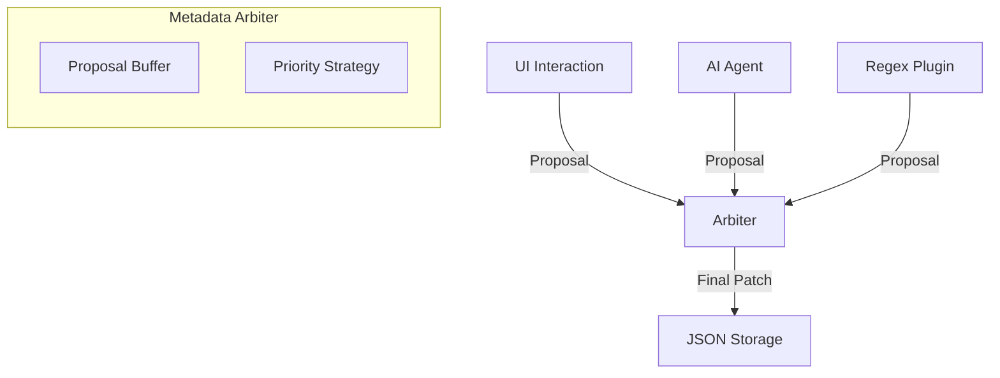
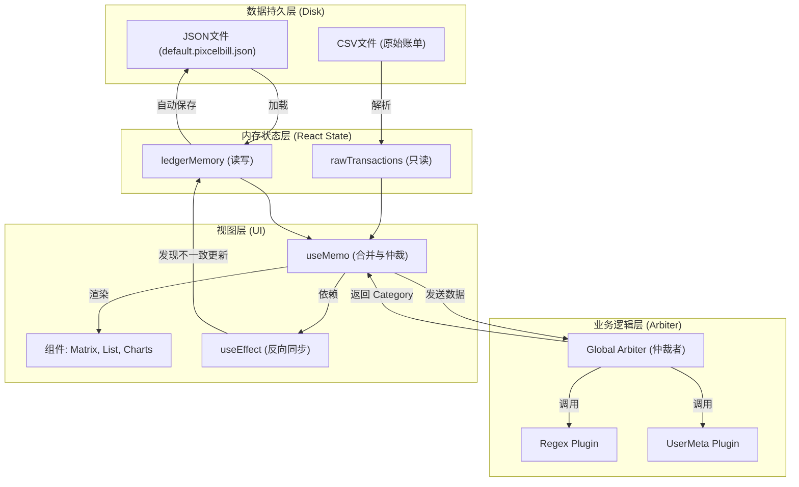

# 极简像素风账单整合器设计文档 (PixelBill)

**Designed by CyberZen Studio**

## 1. 项目概述
本项目是一个运行在本地的纯前端单页应用（SPA）个人记账应用，旨在安全、高效地整合微信和支付宝的账单流水 CSV 文件。项目采用 **"当代生成式点阵" (Contemporary Generative Dot Matrix)** 风格，去除多余装饰，强调数据的纯粹与美感。

PixelBill 奉行“生成式极简主义”与“赛博禅意”的设计哲学，采用 “当代生成式点阵” (Contemporary Generative Dot Matrix) 风格，旨在构建一个 冷静、理性、清晰、秩序感、像素美学的数字化金融终端 。

它摒弃一切多余装饰，利用 实体像素 （象征金钱/价值）与 虚空网格 （象征秩序/空间）的二元隐喻将抽象数据具象化；通过 固定深空背景 与 4秒呼吸光晕 营造出独特的 赛博禅意 (Cyber-Zen) ；让数据成为界面本身，利用 动态活跃度矩阵 与 心理账户点阵 ，将冰冷的流水重构为富有韵律的视觉秩序。

## 2. 视觉设计系统 (Visual Design System)

本章节定义了 PixelBill 的核心视觉语言，旨在构建一个精密、理性且富有生命力的数字金融终端界面。

### 2.1 核心设计哲学 (Design Philosophy)

*   **混合像素点阵 (Hybrid Pixel-Dot)**: 
    *   **Pixels (实体)**: 方形像素块象征确定的“金额”与“实体资产”。使用绿色像素块从隐喻层面与金钱挂钩。
    *   **Dots (虚空)**: 圆形点阵或网格象征“数据流”与“底层结构”。用于背景、装饰和非强调性信息。
*   **生成式极简主义 (Generative Minimalism)**: 界面元素并非静态堆砌，而是由数据驱动生成。活跃度矩阵、金额条形码等元素随数据的变化而呈现不同形态。
*   **非侵入式交互 (Non-intrusive Interaction)**: 摒弃弹窗和强引导，采用呼吸光效、微小的故障 (Glitch) 效果和透明度变化来提示状态。

### 2.2 栅格与布局 (Grid & Layout)

*   **Base Unit**: 4px。所有间距、尺寸均为 4px 的倍数。
*   **Layout Grid**: 12 列响应式栅格系统。
    *   Desktop: 最大宽度 1024px，居中显示。
    *   Mobile: 100% 宽度，两侧保留 24px padding。
*   **Fixed Background**: 背景采用固定定位 (`fixed inset-0`) 的点阵纹理，层级 `z-[-1]`，确保内容滚动时背景保持静止，营造深邃的“空间感”。
*   **Spacing**: 强调疏密有致。
    *   Tight: 4px / 8px (组件内部)
    *   Default: 16px / 24px (组件之间)
    *   Loose: 48px / 64px (区块之间)

### 2.3 字体排印 (Typography)

采用混合字体策略，以区分“数据阅读”与“品牌表达”。

*   **Display Font (标题/品牌)**: 
    *   **Pixel**: `Press Start 2P` - 用于 "PIXEL" 字样，传递复古计算感。
    *   **Grid Dot Matrix**: **自定义网格点阵实现** - 用于 "BILL" 字样。弃用字体渲染，改用 4x5 标准点阵网格构建字母，确保行列严格对齐。
    *   **视觉对齐**: "BILL" 点阵字样通过 `-translate-y-[2px]` 微调，确保与左侧 "PIXEL" 文字实现完美的光学对齐。
*   **Body/Data Font (正文/数据)**: 
    *   **Monospace**: `Space Mono`, `Microsoft YaHei Mono` - 用于所有金额、日期、正文。
    *   **特性**: 等宽字体确保了数据列表的纵向对齐，增强了“账单”的表格属性。

### 2.4 色彩系统 (Color System)

基于 Dark Mode 优先的设计，使用高对比度的荧光色点缀深色背景。

*   **Background (Canvas)**:
    *   `--bg-color`: `#09090b` (Zinc 950)
    *   `--card-bg`: `#111111` (卡片背景，微弱提升层级)
*   **Foreground (Content)**:
    *   `--text-primary`: `#e4e4e7` (Zinc 200)
    *   `--text-dim`: `#6b7280` (Gray 500，用于辅助信息)
*   **Semantic Colors (Functional)**:
    *   **Pixel Green**: `#10b981` (Emerald 500) - 仅用于品牌标识和 Logo 呼吸灯。
    *   **Alipay Blue**: `#0ea5e9` (Sky 500) - 支付宝支付、链接。
    *   **Expense Red**: `#ef4444` (Red 500) - 所有支出金额显示。
    *   **Income Yellow**: `#eab308` (Yellow 500) - 所有收入金额显示。

### 2.5 动效与交互 (Motion & Interaction)

*   **Breathing & Glow (呼吸与光晕)**: 
    *   **Cycle**: 4秒 (4s) 慢速呼吸周期，模拟电子设备的待机状态。
    *   **Text Glow**: 标题 "BILL" 采用 `drop-shadow` 动画，在 50% 透明度时收缩光晕，100% 时扩散光晕。
    *   **Box Glow**: Logo 像素块采用 `box-shadow` 动画，产生真实的“发光元件”质感。
*   **Glitch (故障)**: 在活跃度矩阵中引入极低概率的随机位移或透明度抖动，模拟老式显示器的信号不稳定感。
*   **Micro-interactions**:
    *   **Hover**: 列表项悬停时，左侧指示器旋转 45 度，边框高亮。
    *   **Load**: 数据加载时，使用类似终端打字机或数据流解码的动画。
*   **Context-Aware Transitions (上下文感知转场)**:
    *   **Tab Switching (标签切换)**: 采用 **"Slide + Blur + Fade"** 组合动画。内容根据切换方向（左/右）进行横向位移，配合模糊和透明度变化，营造空间导航感。
    *   **Pagination (翻页)**: **无动画 (Instant)**。移除所有过渡效果，确保数据即时响应，避免重复浏览时的视觉疲劳。

### 2.6 核心组件规范 (Component Specifications)

#### A. Header (控制台)
*   **Logo**: 结合像素与点阵字体，左侧绿色像素块应用 `animate-box-glow` 动画。
*   **Title**: "PIXEL" 使用像素字体，"BILL" 使用自定义点阵组件并应用 `animate-text-glow` 绿色光晕。
*   **Subtitle**: "GENERATIVE FINANCIAL TRACKER" 左侧 padding 对齐 Logo 宽度，保持视觉整洁。
*   **Controls**: 按钮摒弃传统实体背景，采用“文本+前置像素块”的形式，Hover 时改变透明度。

#### B. Activity Matrix (活跃度矩阵)
*   **Visualization**: 14 天数据可视化。
*   **Data-Ink**: 每一列代表一天，由 20 个垂直排列的微型像素块组成。
*   **Intensity**: 
    *   高度：固定 20 格。
    *   激活数量：由 `Total Expense` 决定。
    *   透明度/颜色：当日无消费则微弱显示占位符，有消费则高亮。支持 Hover 查看详情。

#### C. Transaction List (流水清单)
*   **Row Style**: 极简条目，去除斑马纹，仅保留底部分割线或 margin。
*   **Content Layout**:
    *   **Primary Line**: `[Category Tag] Product/Counterparty`
        *   **Category Tag**: 仅非 `others` 分类显示。格式 `[CATEGORY]` (如 `[MEAL]`)，颜色 `text-income-yellow`。
    *   **Secondary Line**: `Raw Class • Counterparty`
        *   使用 CSV 原始分类字符串 (Raw Class) 作为副标题，而非归一化后的分类名，保留原始数据细节。
*   **Indicator**: 
    *   **WeChat**: 3x3 绿色实心像素块。
    *   **Alipay**: 3x3 蓝色实心像素块。
*   **Amount Visualization**: **心理账户分级点阵 (Psychological Account Matrix)**。
    *   **问题解决**: 解决线性归一化导致小额交易（如 5元 vs 40元）无法区分的问题。
    *   **逻辑**: 采用符合生活经验的**非线性固定阈值**，确保不同量级的消费有稳定的视觉反馈。
    *   **分级标准**:
        *   **1 Dot**: ≤ 20 (琐碎/早餐/饮料)
        *   **2 Dots**: ≤ 100 (正餐/日用品/打车)
        *   **3 Dots**: ≤ 300 (聚餐/购物/超市)
        *   **4 Dots**: ≤ 2000 (轻奢/电子/大额)
        *   **5 Dots**: > 2000 (巨额/房租/理财)
    *   **视觉**: 保持 5 点阵列，使用 **像素方块**（非圆点）表示消费量级，**支出使用红色**，收入使用黄色。

## 3. 功能特性与交互流程 (Features & Interaction)

### 3.1 核心功能 (Core Features)

*   **F1. 智能数据导入 (Smart Import)**:
    *   **批量处理**: 支持一次性选择文件夹，系统自动递归读取其中所有 `.csv` 文件。
    *   **格式自适应**: 自动识别微信支付 (UTF-8) 和支付宝 (GBK) 账单格式，无需人工干预编码。
    *   **隐私安全**: 采用纯前端解析 (Local Parsing)，所有数据均在浏览器内存中处理，绝不上传服务器。

*   **F2. 生成式活跃度矩阵 (Generative Activity Matrix)**:
    *   **时间窗口**: 动态展示最近 14 天的消费热力。
    *   **数据映射**: 像素阵列的高度与透明度直接映射当日消费总额 (Total Expense)。
    *   **动态阈值**: 系统根据当前数据范围自动计算最大值 (Max Value)，动态调整可视化比例。

*   **F3. 智能交易分类 (Smart Categorization)**:
    *   **自动标记**: 内置关键词引擎（支持扩展），自动识别“餐饮”、“外卖”等消费场景并标记为 `[MEAL]`。
    *   **多维视图**: 提供 `ALL` (全部)、`MEAL` (正餐)、`OTHER` (非正餐) 三种视图，支持一键切换。

*   **F4. 极简数据清洗 (Data Sanitization)**:
    *   自动清洗金额字段中的特殊符号（如 `¥`、`,`）和异常字符。
    *   统一时间戳格式，默认按交易时间倒序排列。

### 3.2 交互设计 (Interaction Design)

*   **I1. 数据加载流 (Data Loading Flow)**:
    *   `[Action]`: 用户点击 `[LOAD DATA]` 按钮。
    *   `[System]`: 唤起操作系统原生文件选择器（支持多选/文件夹）。
    *   `[Feedback]`: 界面进入 `PROCESSING DATA STREAMS...` 状态，显示像素加载动画。
    *   `[Result]`: 数据解析完成，界面刷新，活跃度矩阵执行生长动画。

*   **I2. 视图与过滤 (View & Filtering)**:
    *   **视图切换**: 点击 `MEAL` 标签 -> 交易列表执行过滤 -> 顶部统计数据 (Total Expense) 实时重算 -> 活跃度矩阵重绘以反映筛选后的数据分布。
    *   **时间范围**: 修改 `FROM` / `TO` 日期 -> 系统实时过滤在此时间窗口之外的交易。

*   **I3. 微交互与反馈 (Micro-interactions)**:
    *   **Hover Matrix**: 鼠标悬停在矩阵某列 -> 浮现详细信息 Tooltip (日期/金额/笔数) -> 该列像素块高亮。
    *   **Hover Transaction**: 鼠标悬停在交易行 -> 左侧来源方块 (Source Pixel) 旋转 45° -> 背景色微弱发光 -> 增强行内信息的对比度。
    *   **Theme Toggle**: (目前锁定为 Dark Mode) 使用高对比度配色方案。
    *   **Date Range Picker**: 
        *   **Trigger**: 点击 Dashboard 顶部的 `DATA_RANGE` 区域触发（支持点击文字、箭头或下方条状区域）。
        *   **Style**: 非传统日历弹窗。采用**双滑块像素时间轴 (Dual-Slider Pixel Timeline)** 与 **原位展开编辑面板** 结合。
        *   **Interaction**: 
            *   **常态**: 紧凑的日期显示，下方仅有一条细微的进度条。
            *   **展开**: 也就是“生长”。面板从常态位置原位扩大，托举起日期数据，并平滑过渡到可编辑状态。
            *   **操作**: 支持拖拽滑块快速选择，也支持点击日期文字进行精确输入。

### 3.3 交互设计案例分析：二级面板 (Case Study: Secondary Panel)

本项目以 `DateRangePicker` 为例，定义了 PixelBill 的“二级面板”交互规范。

#### 1. 设计哲学：从“弹出”到“生长” (From Pop-up to Growth)
*   **拒绝突兀 (Anti-Modal)**: 传统的 UI 使用模态弹窗强行打断用户流。PixelBill 要求**同源性**——编辑面板不应是凭空跳出来的“异物”，而应当是原数据（日期文字）在受激（交互）后，自然**生长、舒展**而成的形态。
*   **秩序感 (Order)**: 动画过程必须维护 Grid（4px网格）对齐。
*   **光影隐喻 (Light Metaphor)**: 鼠标悬停时的微光、展开时的边框高光，都暗示了数据正在“被激活”。

#### 2. 动画基本原则
*   **同一性 (Identity)**: 屏幕上的像素变了，但逻辑上的组件不能变。不再销毁/创建组件，而是让组件在“紧凑”和“松散”两种状态间呼吸。
*   **空间锚定 (Spatial Anchoring)**: 运动物体以原数据中心为锚点，向两侧舒展。这给了用户一种“它还是它，只是变大了”的心理安全感。
*   **完全可逆 (Reversibility)**: 收起的动画必须是展开的**严格倒放**。能量耗尽后，物体应当沿原路回归平静。

#### 3. 实现策略
*   **状态驱动 (State-Driven)**: 使用 React State (`readOnly`) 配合 CSS transition 驱动样式变化，而非手动计算关键帧。
*   **布局投影的克制 (Layout Projection Control)**: 对于精密排版，**显式地控制尺寸和位置**（如明确指定 `width`, `left`）比交给自动布局引擎更稳健，消除“果冻效应”。
*   **分层交互 (Layered Interaction)**: 引入透明覆盖层 (`z-40 overlay`) 简化触发逻辑，将视觉层与交互层分离，提升容错率。

### 3.4 分页交互规范 (Pagination Specification)

针对明细列表 (Transaction List) 的分页需求，采用 **“光纤轨道 + 透视滑块” (Fiber Track & Perspective Thumb)** 设计，将导航控制与进度指示融合，营造精密仪器的操作感。

*   **布局结构 (Layout Structure)**: 
    *   **位置**: 列表底部，Margin Top: 48px，Margin Bottom: 64px。
    *   **宽度**: 轨道与上方列表完全等宽 (Full Width)。
    *   **层级**: Track 位于底层 (`z-0`)，Thumb 悬浮于上层 (`z-10`)。

*   **组件构成 (Components)**:
    *   **1. Fiber Track (光纤轨道)**:
        *   **形态**: 极细的绿色实线 (`1px` height, `bg-emerald-500/30`)，横跨整个容器。
        *   **锚点**: 轨道左右两端各连接一个 **3x3 绿色实心像素块**，作为视觉锚点。
        *   **交互**: Hover 轨道任意区域时，线条亮度提升并产生绿色光晕 (`box-shadow/drop-shadow`)。

    *   **2. Integrated Thumb (集成式滑块)**:
        *   **定义**: 一个包含翻页按钮和页码的**胶囊型容器**，在轨道上滑动。
        *   **结构**: `[ Prev ] — [ Page Indicator ] — [ Next ]` (Flex布局，内部间距紧凑)。
        *   **视觉状态**:
            *   **Idle (常态)**: 
                *   背景: 深色不透明 (`bg-zinc-900`)，**视觉上遮断**下方的绿色轨道线。
                *   边框: 微弱灰边或无边框。
            *   **Hover (悬停)**: 
                *   整体反馈: 边框产生白色高光 (`border-zinc-400` 或 `box-shadow`)，内部**页码文字**变绿 (`text-emerald-500`)。
            *   **Active (拖拽/点击)**: 
                *   **透视模式 (Perspective Mode)**: 背景变为 **透明 (Transparent)**，边框高亮发光。
                *   **视觉奇观**: 此时透过滑块可以看到底层的**深空背景** (Fixed Background)，同时**强制隐藏**滑块区域下方的绿色轨道线（通过 Mask 或分段渲染实现），营造滑块是“浮空透镜”的错觉。

    *   **3. Internal Elements (滑块内部)**:
        *   **Navigation Buttons (翻页键)**:
            *   **内容**: 白色像素字体符号 `<` 和 `>`。
            *   **位置**: 固定在滑块内部的最左侧和最右侧。
            *   **交互**: 独立响应 Hover，触发 **变绿 (`text-emerald-500`)** + **放大 (`scale-110`)** + **高亮 (`drop-shadow`)**。
        *   **Page Indicator (页码)**:
            *   **内容**: `01 / 12` (Mono Font)。
            *   **位置**: 滑块绝对居中。
            *   **颜色**: 跟随滑块状态（常态灰 -> Hover绿 -> Active亮绿）。

*   **交互逻辑 (Logic)**:
    *   **拖动**: 拖动整个滑块可快速预览页码。
    *   **点击**: 
        *   点击轨道空白处 -> 滑块跳跃至该位置。
        *   点击左右箭头 -> 翻页。
    *   **分页量**: 20条/页。
    *   **刷新**: Instant / No Animation (无动画)。为了保持浏览的连贯性与响应速度，翻页操作不应用任何过渡动画，实现数据的即时刷新。

## 4. 数据结构 (Data Structure)

### 4.1 数据模型 (TypeScript Interface)
```typescript
type SourceType = 'wechat' | 'alipay';

// 交易状态枚举
export enum TransactionStatus {
  SUCCESS = 'SUCCESS', // 支付成功, 交易成功, 对方已收钱
  REFUND = 'REFUND',   // 已全额退款, 已退款, 退款成功
  CLOSED = 'CLOSED',   // 交易关闭, 已取消
  PROCESSING = 'PROCESSING', // 处理中, 待确认
  OTHER = 'OTHER'      // 其他
}

interface Transaction {
  id: string;           // 唯一标识 (SHA-256 Hash of Unique Fingerprint)
  time: string;         // 交易时间 (YYYY-MM-DD HH:mm:ss) - JSON存储/展示用
  originalDate: Date;   // [Runtime Only] 原始时间对象，用于UI组件和日期计算，不写入JSON

  sourceType: SourceType; // 来源 (Renamed from type)
  category: CategoryType; // 统一后的分类 (meal | others)
  rawClass: string;     // 原始CSV中的分类字符串 (用于展示)
  counterparty: string; // 交易对方
  product: string;      // 商品名称
  amount: number;       // 金额 (绝对值)
  direction: 'in' | 'out'; // 收支方向
  
  paymentMethod: string; // 支付方式 (e.g. "零钱", "招商银行(1234)", "花呗")
  status: TransactionStatus; // 交易状态

  // --- Enhanced Fields (Replaces raw) ---
  remark?: string;      // 备注/商品说明 (Critical for AI context)
  // raw: any;          // REMOVED: 为了精简存储体积，不再保存原始CSV行
}
```

### 4.2 数据完整性策略 (Data Integrity Strategy)

为确保在多次导入 CSV、不同设备同步或元数据关联时的数据一致性，本项目采用**确定性 ID 生成策略 (Deterministic ID Generation)**。

*   **ID Generation (ID 生成)**:
    *   **Source**: `SHA-256(SourcePrefix + TradeNo)`.
    *   **Constraint**: **Strictly Required (严格校验)**.
    *   **Policy**: If `TradeNo` (交易单号) is missing, the record **MUST be silently discarded**. Fallback strategies (e.g., using date/amount hash) are **FORBIDDEN** to prevent duplicate or unstable IDs.
    *   **Example**: `SHA-256("wx:4200002068202412155678901234")`.

### 4.3 元数据存储结构 (Metadata Schema)

为了支持 AI 智能分类与人工修正的持久化，系统采用 **"JSON as Database"** 策略，将完整的交易数据与元数据合并存储，确保 JSON 文件成为自包含的单一事实来源 (Single Source of Truth)。

```typescript
// 类别枚举 (初始只包含 meal 和 others，支持扩展)
export type CategoryType = 'meal' | 'others' | string;

// 基础交易数据 (对应 Transaction 接口的 JSON 序列化形式)
export interface TransactionBase {
  id: string;
  time: string;         // 交易时间 (YYYY-MM-DD HH:mm:ss)
  // originalDate: Date; // Runtime Only - Not Persisted
  sourceType: SourceType; // Renamed from type
  category: CategoryType;
  rawClass: string;
  counterparty: string;
  product: string;
  amount: number;
  direction: 'in' | 'out';
  paymentMethod: string;
  transactionStatus: TransactionStatus;
  remark?: string;      // 新增: 备注
}

// 元数据扩展
export interface TransactionMeta {
  // --- 智能层 (AI Layer) ---
  ai_category: CategoryType; // AI 建议分类 (默认为 "")
  ai_reasoning: string;      // AI 推理理由 (默认为 "")
  
  // --- 人工层 (User Layer - 优先级最高) ---
  user_category: CategoryType; // 用户手动分类 (默认为 "")
  user_note: string;         // 用户备注 (默认为 "")
  
  // --- 系统层 (System Layer) ---
  is_verified: boolean;       // 是否已确认 (确认后 AI 不再覆盖)
  updated_at: string;         // 最后更新时间 (YYYY-MM-DD HH:mm:ss)
}

// 完整的记录结构 = 基础数据 + 元数据
// 注意: 序列化时即使 metadata 字段为空，也必须写入 JSON (值为空字符串)，方便用户和 AI 补全
export interface FullTransactionRecord extends TransactionBase, TransactionMeta {}

// 账本记忆文件 (Ledger Memory) - *.pixelbill.json
export interface LedgerMemory {
  version: string;            // e.g. "1.1"
  last_sync: string;          // Timestamp string (YYYY-MM-DD HH:mm:ss)
  defined_categories: string[]; // 支持的分类列表，初始为 ['meal', 'others']
  records: Record<string, FullTransactionRecord>; // ID -> Full Record
}
```

### 4.4 持久化机制 (Persistence)

*   **技术方案**: File System Access API - `showDirectoryPicker`。
*   **IO 策略 (IO Strategy)**: **目录即仓库 (Directory as Repository)**。
    *   **Single Authorization (单次授权)**: 用户不再选择具体文件，而是授权一个“账单目录”。应用获得该目录的读写权限。
    *   **Auto-Discovery (自动发现)**: 系统自动扫描目录下的所有 `.csv` 文件进行聚合。
    *   **Hybrid Mode (混合模式)**:
        *   **Default (Zero-Config)**: 系统优先寻找 `pixel_bill_memory.json`。若不存在，则在首次需要写入时自动创建。
        *   **Advanced (Manual Override)**: 允许高级用户通过 **Memory Capsule** 指定其他 JSON 文件（如 `family_ledger.json`）或创建新文件。
    *   **Implicit Sync (隐式同步)**: 所有的分类调整与备注，均自动同步至当前激活的 JSON 文件。

### 4.5 记忆胶囊 (Memory Capsule)**（尚未实现）**

作为伴生元数据系统的核心组件，它不仅是状态指示器，更是高级数据管理的**隐式入口**。

*   **位置**: 页面底部 (Footer) 居中，保持低调。
*   **形态**: 极简胶囊形状 (Pill Shape)，类似电子设备的指示灯或物理接口。
*   **状态反馈 (Visual Feedback)**:
    *   **Disconnected**: 灰色轮廓/空心，无呼吸。表示尚未关联目录。
    *   **Connected**: 绿色实心点 + 4s 周期呼吸。表示已锁定元数据文件。
    *   **Saving**: 快速闪烁或颜色瞬变 (Yellow/White)。
*   **交互逻辑 (Interaction)**:
    *   **Hover**: 
        *   显示当前连接的文件名 (e.g., `pixel_bill_memory.json`)。
        *   如果是默认创建的文件，提示“Default Memory”。
    *   **Click**: 
        *   **Action**: 唤起 **Memory Manager** (悬浮菜单或极简面板)。
        *   **Options**:
            1.  **Switch Memory**: 列出当前目录下所有符合格式的 JSON 文件供切换。
            2.  **New Memory**: 允许输入新文件名并创建空白元数据文件。

### 4.6 伴生元数据仲裁系统 (Associated Metadata Arbitration System)

PixelBill 采用 **“插件化仲裁” (Plugin-based Arbitration)** 架构处理多源分类建议。系统不直接修改数据，而是由各方提交“提案”，最终由仲裁者决定。

#### A. 核心架构 (Core Architecture)

*   **Raw Data (只读)**: CSV 文件，Single Source of Truth。
*   **Metadata (读写)**: JSON 文件，存储增强信息。
*   **Arbitration Layer**: 位于 UI显示 与存储之间的决策层。



#### B. 优先级策略 (Priority Strategy)

仲裁者采用**可配置的优先级队列**（默认：User > Rule > AI），通过 **"Pull" (主动调度)** 模式实时从各插件获取提案。

1.  **UserMetaPlugin (用户信源插件)**: 
    *   **触发**: 实时读取 `user_category` 元数据。
    *   **行为**: 若存在用户分类，生成 `source: USER` 提案。此提案具有**绝对锁定权**。
    *   **is_verified 机制**: 
        *   **显式锁定**: `is_verified` 状态**仅**通过用户显式调用 `verifyTransaction` API 触发，**不**随 User 提案自动生效。
        *   **解除锁定**: 用户可调用 `unverifyTransaction` API 将状态重置为 `false`，此时数据重新接受仲裁。
        *   **行为**: 
            *   `true`: 仲裁者直接返回当前分类，跳过所有插件计算。
            *   `false`: 正常执行 User > Rule > AI 的优先级仲裁。
        *   **价值**: 锁定的数据将作为“黄金数据集 (Golden Dataset)”，用于未来 AI 模型的训练与微调。
2.  **System Rule (系统规则)**: 
    *   **触发**: 正则表达式插件匹配结果。
    *   **行为**: 仅在无 User 提案时生效。
3.  **AI Suggestion (AI 建议)**: 
    *   **触发**: LLM 推理结果。
    *   **行为**: 兜底建议。

在多信源（User/Rule/AI）仲裁体系中，若所有有效信源均静默（如用户清空分类且无规则命中），系统将不再重置为默认值，而是实施‘状态惯性’策略——保留该交易上一次的历史分类；仅当连历史状态也不存在或非法时，才兜底归为 others 。

#### C. 插件接口规范 (Plugin Interface)

```typescript
export type ProposalSource = 'USER' | 'RULE_ENGINE' | 'AI_AGENT';

// 提案结构
export interface Proposal {
  source: ProposalSource;
  category?: string;
  reasoning?: string;
  // confidence: number; // 暂不启用置信度逻辑
  timestamp: number;
}

// 插件接口
export interface ICategoryPlugin {
  name: string;
  version: string;
  // 核心分析函数
  analyze(transaction: TransactionBase): Promise<Proposal | null>;
}
```

#### D. JSON 热重载与外部数据治理 (JSON Hot-Reload & Data Governance)

为了提供极致的数据掌控力，系统将 **本地 JSON 文件** 视为唯一的、开放的数据库接口。

1.  **机制**:
    *   **双向同步**: App 启动后，将持续监听（Smart Polling）JSON 文件的 `lastModified` 属性。
    *   **热重载 (Hot Reload)**: 一旦检测到外部修改（如 VSCode 编辑、脚本批处理），App 将立即重新加载数据，触发完整的仲裁循环，并实时刷新 UI。
    
2.  **批量处理场景**:
    *   无需专用的“导入 API”。
    *   用户可编写 Python/Node 脚本直接修改 JSON 文件的 `user_category` 或 `ai_category` 字段。
    *   App 将自动感知这些变更，并将其应用到视图中。这使得利用本地 LLM 进行大规模离线数据清洗成为可能。

#### E. 触发机制与生命周期 (Trigger & Lifecycle)

仲裁器不仅仅是被动比较，还负责管理插件的**调度时机**。不同插件的触发成本与时效性要求不同，需差异化处理。

1.  **UserMetaPlugin (实时/热数据)**
    *   **触发时机**: 
        *   **初始化加载**: 应用启动读取 JSON 元数据时。
        *   **用户交互**: 用户通过 UI 修改 `category` 或 `note` 时（实时触发）。
        *   **解锁操作**: 用户调用 `unverifyTransaction` 时。
    *   **调度策略**: **同步 (Synchronous)**。必须立即响应，确保用户操作即时反馈。

2.  **RuleEnginePlugin (本地计算/低成本)**
    *   **触发时机**: 
        *   **数据导入**: 新 CSV 记录被解析时。
        *   **规则变更**: 用户新增或修改正则规则时（触发全量或增量重新仲裁）。
        *   **Fallback**: 当 User 提案被移除（如清空 `user_category`）时。
    *   **调度策略**: **即时 (Immediate)**。本地正则匹配速度极快，可在主线程或微任务中完成，无需节流。

3.  **AIAgentPlugin (远程调用/高成本)**
    *   **状态**: *待完善 (Pending Refinement)* - 具体的触发阈值、防抖策略及上下文构建逻辑尚需进一步设计。
    *   **触发时机 (Draft)**: 
        *   **显式请求**: 用户点击“智能分类”按钮（针对单条或多条）。
        *   **空值兜底 (Lazy)**: 当 User 和 Rule 均返回 `Uncategorized`，且用户开启“自动 AI 补全”配置时。
        *   **批量作业**: 导入大量新数据后的后台静默队列。
    *   **调度策略**: **异步 + 队列 + 防抖 (Async Queue & Debounce)**。
        *   避免对同一笔交易频繁请求。
        *   支持批量打包请求 (Batch Processing) 以节省 Token。
        *   **必须**在 UI 上展示“AI 思考中”状态。

#### F. 仲裁核心循环 (Arbitration Loop)

```typescript
async function arbitrate(tx: Transaction, trigger: TriggerType) {
  // 1. Check Lock
  if (tx.is_verified && trigger !== 'USER_UNLOCK') return tx.current_category;

  // 2. User Level (Sync)
  const userProposal = userPlugin.analyze(tx);
  if (userProposal) return apply(userProposal);

  // 3. Rule Level (Sync/Fast)
  const ruleProposal = rulePlugin.analyze(tx);
  if (ruleProposal) return apply(ruleProposal);

  // 4. AI Level (Async/Costly)
  if (shouldTriggerAI(trigger, config)) {
    queueAIJob(tx); // Don't await, return 'Thinking...' or fallback
    return 'PROCESSING'; 
  }

  return 'Uncategorized';
}
```
## 5. 系统架构 (System Architecture)

### 5.1 分层架构图 (Layered Architecture)

本系统遵循 **M-V-VM (Model-View-ViewModel)** 变体架构，结合 React 单向数据流与 File System Access API，实现“本地文件即数据库”的闭环设计。



### 5.2 核心层级职责

| 层级 | 核心对象 | 职责 | 存储方式 |
| :--- | :--- | :--- | :--- |
| **L1: Persistence** | `CSV`, `JSON` | 数据的物理载体。JSON 是唯一的“数据库”。 | 硬盘文件 |
| **L2: State** | `rawTransactions`<br>`ledgerMemory` | React State，应用眼中的“事实”。<br>- `Raw`: 绝对不可变，仅从 CSV 读取。<br>- `Meta`: 可变，存储用户标注、分类结果。 | 内存 (RAM) |
| **L3: Logic** | `Arbiter`<br>`useMemo` | **纯函数式计算**。输入 Raw + Meta，输出最终 Transaction 列表。不存储数据，只负责即时计算。 | 瞬时计算 (CPU) |
| **L4: View** | `UI Components` | 负责将 L3 计算出的结果渲染到屏幕。 | DOM 节点 |

### 5.3 数据流向与死循环防御

1.  **正向流 (Render)**: `[Raw, Meta]` -> `useMemo (Arbiter)` -> `Final Transactions` -> `UI Rendering`
2.  **反向流 (Sync)**: `UI Rendering` -> `useEffect` -> `Update Meta` -> `Write JSON`
3.  **死循环防御**:
    *   **风险**: `Update Meta` 触发重绘，重绘触发 `useEffect`，`useEffect` 再次 `Update Meta`。
    *   **策略**: **值收敛 (Value Convergence)**。在 `useEffect` 中严格对比当前 `Storage` 中的值与 `Arbiter` 计算出的值，仅当 **逻辑值 (Category)** 真正不一致时才触发更新，确保一次更新后系统立即达到稳态。

## 6. 开发守则 (User Rules)

为确保项目始终符合设计哲学并维护代码质量，所有开发行为必须遵循以下规则：

1.  **交互设计红线 (Interaction Design Red Line)**:
    *   **涉及前端交互逻辑变更，必须先在 `DESIGN.md` 完成设计并获得用户明确“确认”指令授权后方可实施代码；严禁未授权修改，且仅明确肯定回复视为确认，模糊表态（如“可以”）无效。**
    *   **Any changes to frontend interaction logic must be designed in `DESIGN.md` first and authorized by an explicit "CONFIRM" command from the user before implementation; unauthorized modifications are strictly prohibited, and vague responses (e.g., "OK") do NOT constitute confirmation.**

2.  **先设计后实现 (Design First)**: 
    *   面临新需求时，**必须**先更新 `DESIGN.md`，明确视觉规范、交互流程和数据结构。
    *   设计文档是项目的唯一真理来源 (Single Source of Truth)。

3.  **数据优先 (Data First)**: 
    *   前端改动不得破坏后台数据的完整性。
    *   IO 操作必须具备原子性或防丢失机制（如自动保存、错误恢复）。

4.  **极简原则 (Minimalism)**: 
    *   增加功能 $\neq$ 增加按钮。
    *   优先考虑自动化、上下文感知的设计。能自动推断的，绝不让用户点击。
    *   **非侵入式**: 所有的状态提示应当是环境化的 (Ambient)，而非阻断式的 (Modal)。

## 6. 版权信息
Footer 显示: `@edgarzhong 2026`
